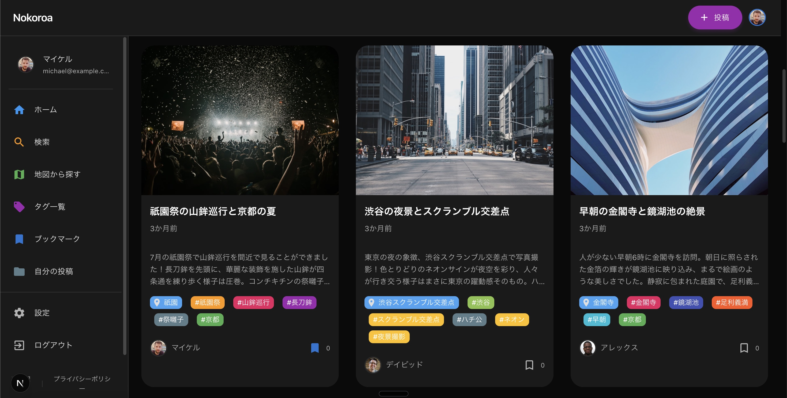

# Nokoroa

旅の思い出を共有するソーシャルプラットフォーム

**URL**: https://nokoroa.com

## 概要

Nokoroaは、旅行の思い出を写真と共に共有できるWebアプリケーションです。ユーザーは旅先での体験を投稿し、地図上で視覚的に探索できます。

### 主な機能

- 写真・位置情報・タグ付きの旅行体験投稿
- Google Mapsを活用した地図検索
- ブックマーク機能
- フォロー/フォロワー機能
- ユーザープロフィール管理
- Google OAuth認証

## 開発背景

旅行が好きで、旅先での思い出を共有することに特化したサービスがあれば便利だと感じたのがきっかけです。

Instagramなどの既存SNSでは、投稿形式が限定されていたり、旅行以外の様々な投稿が混在してしまい、旅行体験だけを振り返ったり探したりするのが難しいと感じていました。また、旅行に特化した既存アプリを探してみましたが、満足できるものが見つかりませんでした。

そこで、旅行の思い出共有に特化し、地図から投稿を探せるなど旅行体験に最適化されたプラットフォームを自分で作ることにしました。

## 技術スタック

### フロントエンド
- Next.js 15 (App Router / Server Components / Standalone Output)
- React 19
- TypeScript 5
- Material-UI v7 (MUI)
- MUI Icons
- Emotion (CSS-in-JS)
- SWR (データフェッチング・キャッシング)
- React Hook Form (フォーム管理)
- Zod (スキーマバリデーション)
- date-fns (日付処理)
- react-hot-toast (トースト通知)
- Google Maps JavaScript API
- Google OAuth 2.0
- カスタムフック (無限スクロール、検索サジェスト等)
- ESLint / Prettier

### バックエンド
- Node.js 23
- NestJS 11
- TypeScript 5
- Prisma ORM 6
- PostgreSQL
- RESTful API設計
- Passport.js (認証ミドルウェア)
- passport-jwt (JWT戦略)
- passport-google-oauth20 (Google OAuth)
- JWT (トークン認証)
- bcrypt (パスワードハッシュ)
- class-validator / class-transformer (DTO バリデーション・変換)
- Multer (ファイルアップロード)
- RxJS (リアクティブプログラミング)
- CORS (クロスオリジン制御)
- Jest / SuperTest (テスト)
- SWC (高速コンパイラ)
- ESLint / Prettier

### インフラ / DevOps
- Docker (マルチステージビルド)
- Docker Compose (ローカル開発環境)
- AWS VPC (パブリック/プライベートサブネット)
- AWS ECS Fargate (ARM64)
- Amazon ECR (コンテナレジストリ)
- Amazon RDS (PostgreSQL)
- Amazon S3 (画像ストレージ)
- Application Load Balancer
- Route 53 (DNS)
- AWS ACM (SSL証明書)
- AWS Secrets Manager
- AWS CloudWatch (ログ・モニタリング)
- AWS Internet Gateway
- Security Groups (ファイアウォール)
- Terraform (IaC)
- GitHub Actions (CI/CD)
